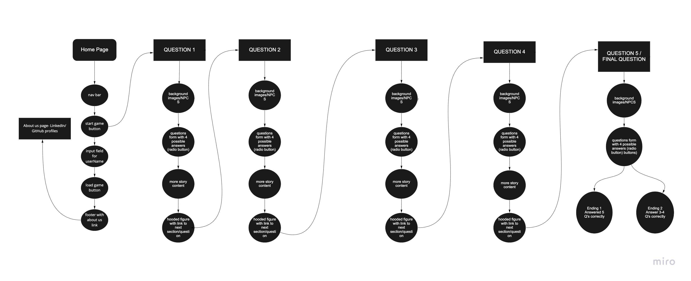

# Ravenclaw

***

Jacob Gregor, Katy Roffe, Brian Kasprzyk, Cameron Walden.

***

Text based trivia game where the user is presented with a series of questions and has to get a certain amount correct to win the game.

5 User Stories:
User Stories we will need:

We will need a way to create my username & class. 
2. As a user I would like to actively see the amount of lives remaining. 
3. As a user I would like to see the total score (Memory regained) I have achieved thus far. 
4. As a user I would like a way to store my Username & class to come back later. 
5. As a user I would like a way to store my total lives and memory remaining to come back 	later. 

Domain-Modeling ->  - See img folder for Domain-Modeling image. 